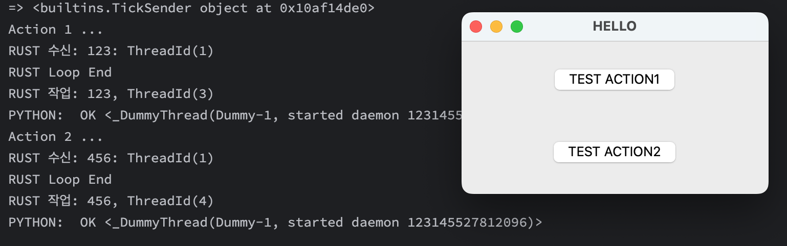

# 파이썬 모듈 - 러스트 mpsc 활용

```
     Python                          Rust                          
+-----------------+      +-------------------------------+            
|                 |      |                               |            
|                 |      | Thread loop      Thread other |
| +-------------+ |      | +----------+     +----------+ |            
| | Rust Sender |---->---- | Receiver |-----|   Work   | |            
| +-------------+ |      | +----------+     +----+-----+ |            
|                 |      |                       |       |            
|                 |      |                       |       |            
|                 |      |             +---------|-----+ |            
|      Done  --------<-----------------|Python Callback| |            
|                 |      |             +---------------+ |            
+-----------------+      +-------------------------------+            
```

1. 파이썬에서 `rally_python_rust_mpsc` 의 ready 를 호출한다.
   인자로 callback 함수를 넣고, 반환값으로 Sender 받는다.
2. 러스트 코드는 초기화하며 Receiver 루프를 만들어 대기한다.
3. 파이썬에서 sender 를 통해 값을 전달하면 러스트에서 루프로 떨어진다.
4. 루프 작업을 마치면 좀더 부하가 심한 작업을 위해 쓰레드를 까고 작업을 던진다. 
   이 부분에 레이온을 사용하면 될 듯하다.
5. 루프는 계속 돌며 Receiver 값을 받고 처리한다.
6. 작업 쓰레드는 일을 마치면 인자로 받은 파이썬 콜백에 결과를 전달한다.

- 파이썬의 큐를 이용할 수도 있지만, 혹시나 더 빠를까 싶어 러스트 채널을 활용했다.
- 전통적인 콜백 구조라서 꼬일 일이 없다.
- 파이썬에서 가져간 러스트 Sender 는 파이썬의 몇 군데 모듈에서 동시에 쏟아붇는 것을 가졍했다.
- 러스트의 쓰레드 루프에서 값 처리를 한 번에 담당하고 그 이상의 작업을 다시 쓰레드로 던져 루프 순환에 방해되지 않게 했다.
  따라서 work 쪽에서 무슨 함수로 처리할지는 이 구조에서 확장하면 된다.


## 파이썬 의존성
- PySide6: gui 테스트를 위해.
- maturin: 러스트를 컴파일해서 파이썬 모듈로 심어준다. 
  pyo3 타입으로 인터페이스를 만들었다. 왜냐면 간편하니까.



